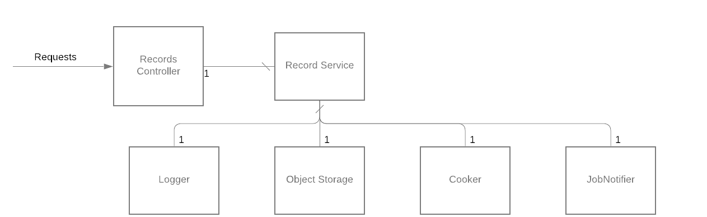

# Pandora cooking server


[](https://codecov.io/gh/SoTrxII/pandora-cooking-server)
[](https://hub.docker.com/r/sotrx/pandora-cooking-server/)

This is the cooking server for [Pandora](https://github.com/SoTrxII/Pandora).
All the audio processing scripts were written by Yahweasel for [Craig](https://github.com/Yahweasel/craig).
This project is just a server wrapper around the cooking scripts.

However, the cooking scripts have been slightly changed :

- Removed exclusive locking (only shared locks except for deletion), allowing multiple downloads at once.

## Usage

Two endpoints are provided.

- GET /:id Synchronously process and download a record by its ID
- POST /:id Asynchronously process a record and store it on the file system/ remote object storage
- DELETE /:id to delete a record raw files

You can choose the output format.

Full API documentation is available [here](https://sotrxii.github.io/Pandora-cooking-server/)

## Architecture



The Cooking server is quite simple :

- The **Records controller** is an express controller, checking requests arguments and forwarding request to the Records Service
- The **Records Service**, handling business logic
- A **logger**. Plain text logging is used in development, [ECS format](https://www.elastic.co/guide/en/ecs/current/index.html) is used in production.
- An **Object Store**, removing the need for a shared volume with Pandora
- The **Cooker** itself, handling the cooking scripts invocations
- A **Job Notifier**, handling messaging for async record processing
#### Dapr

[Dapr](https://github.com/dapr/dapr) is used a decoupling solution. Dapr uses **components** to define the implementation
of some part of the application at runtime using a [sidecar architecture.](https://medium.com/nerd-for-tech/microservice-design-pattern-sidecar-sidekick-pattern-dbcea9bed783)

These components are YAML files mounted in the sidecar as a volume. You can find a sample deployment
using these components in the [minimal deployment](#minimal-deployment) section.

## Minimal deployment

Deployment is explained is [Pandora's README](https://github.com/SoTrxII/Pandora#minimal-deployment)

## Configuration

The cooking server uses two **optionals** environment variables.

```dotenv
# Name of the dapr component to use as a remote object storage
OBJECT_STORE_NAME=<DAPR_COMPONENT_OBJECT_STORE>
# Name of the dapr component to use as an event backend
PUBSUB_NAME=<DAPR_COMPONENT_PUBSUB>
```

If any of these variables are defined, the corresponding Dapr components must be defined.

### Autocooking

A declarative subscription "autocook" is provided in the folder `dapr/components`.
If applied, this subscription will instruct the cooking server to start processing automatically.

When Pandora finishes recording **via the pub/sub method**, it fires a `stoppedRecordingDiscord` event.
This subscription react to this event and start processing the record.

## Some choices explanation

### Why not Alpine ?

The cooking server Docker image is relatively large. A part of the reason is that the image is built over ubuntu.

Although Alpine is the ideal distribution for Docker image in the general case, it is
lacking some unix tools and would require a custom ffmpeg build to run all the possible configuration of the
cooking process. The extra gain in space isn't worth it in my opinion.

Here's some guidelines if you want to make your own spin of the cooking server image.

#### Running without a container / a custom container

These needs to be installed on the system :

- ffmpeg ( http://ffmpeg.org/ ) **compiled with libopus support**
- flac ( https://xiph.org/flac/ )
- oggenc ( https://xiph.org/vorbis/ )
- opusenc ( http://opus-codec.org/ )
- fdkaac ( https://github.com/nu774/fdkaac )
- lame ( https://lame.sourceforge.io/ ) (mp3 support)
- zip and unzip ( http://infozip.org/ )

Quick install command:

```bash
# Debian-based distros
sudo apt install ffmpeg flac vorbis-tools zip fdkaac lame
# Red-Hat based distros (Yes there is really an extra hyphen)
sudo dnf install ffmpeg flac vorbis-tools zip fdk-aac lame
```

Next, all the cooking scripts needs to be compiled. Beware, you will need GCC/make/autoconf
(and maybe more depending on the distro).

```bash
# From the project's root
cd cook
for i in \*.c; do gcc -O3 -o ${i%.c} $i; done
```

The nodeapp can then be transpiled and executed.

```bash
# JS Deps
npm install
# Typescript -> Javascript
npm run build
# You'll need dapr installed on the system !
npm run start:dapr
# Server start
npm run start:dev
```

### Windows compatibility

This project **cannot be executed** on Windows. Windows compatibility would require to rewrite the cooking scripts.
Rewriting these would make keeping up with Yeahweasel updates much more tricky.

However, using either Docker-desktop or WSL2 should work.

## Known limitations && Trivia

- Matroska containers can't contain either AAC or HE-AAC. More precisely, they _should_ but it doesn't work.
  Thus, using AAC and Mastroska together is prevented by the server.
- On Fedora (and probably every Red Hat distros), the fdk-aac package is "crippled" and doesn't support HE-AAC
  out of the box.
